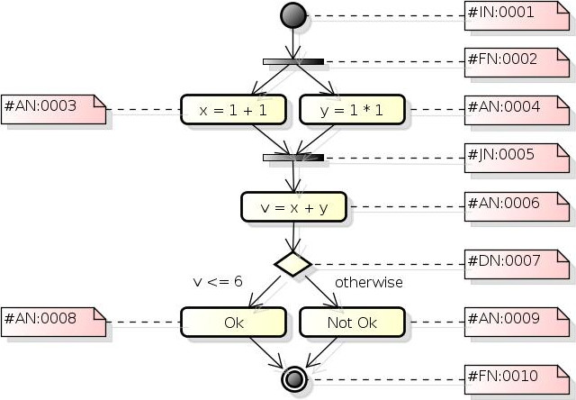
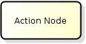
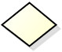
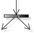
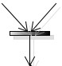
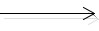

# **Jack Ketch for Flow**

A flow executor for **Java** and **Javascript** code to work in both client and server side.

**Jack Ketch 4 Flow** is an umbrella project. It is intended to provide mechanisms to be a flow executor framework capable of running [Activity Diagrams](http://en.wikipedia.org/wiki/Activity_diagram "Activity Diagram") actions bound to Java and Javascript objects.

**NOTE:** 
+ This document was created on **February 9, 2015** and totally redefined in **April 24, 2015**. Last update was on the ***April 24, 2015***.

## [ Goal ]
Mainly get a [JSON](http://json.org/ "JavaScript Object Notation") data structure representing something similar to an [Activity Diagram](http://en.wikipedia.org/wiki/Activity_diagram "Activity Diagram") and **execute it**!

In other words, the main goal is to get something like the diagram below...



... And transform into a set of data structures similar to the ones below...

```javascript

    {
        initialNodes: [ 
            { id: '#IN:0001' } 
        ],    
        forkNodes: [ 
            { id: '#FN:0002' } 
        ],
        actionNodes: [ 
            { id: '#AN:0003', callback: 'SimpleDiagram::sumOnePlusOne' },
            { id: '#AN:0004', callback: 'SimpleDiagram::sumTwoPlusTwo' },
            { id: '#AN:0006', callback: 'SimpleDiagram::sumXPlusY' },
            { id: '#AN:0008', callback: 'SimpleDiagram::showOk' },
            { id: '#AN:0009', callback: 'SimpleDiagram::showNotOk' }
        ],    
        joinNodes: [
            { id: '#JN:0005' } 
        ],
        decisionNodes: [
            { 
                id: '#DN:0007', 
                context: [ 
                    { attribute: 'v', condition: '=', value: '6', controlFlow: '#CF:0008' }
                ],
                otherwise: { controlFlow: '#CF:0009' }
            } 
        ],
        finalNodes: [ 
            { id: '#FN:0021' } 
        ],
        controlFlows: [
            { id: '#CF:0001', from: '#IF:0001', to: '#FN:0002' },
            { id: '#CF:0002', from: '#FN:0002', to: '#AN:0003' },
            { id: '#CF:0003', from: '#FN:0002', to: '#AN:0004' },
            { id: '#CF:0004', from: '#AN:0003', to: '#JN:0005' },
            { id: '#CF:0005', from: '#AN:0004', to: '#JN:0005' },
            { id: '#CF:0006', from: '#JN:0005', to: '#AN:0006' },
            { id: '#CF:0007', from: '#AN:0006', to: '#DN:0007' },
            { id: '#CF:0008', from: '#DN:0007', to: '#AN:0008' },
            { id: '#CF:0009', from: '#DN:0007', to: '#AN:0009' },
            { id: '#CF:0010', from: '#AN:0008', to: '#FN:0010' },
            { id: '#CF:0011', from: '#AN:0009', to: '#FN:0010' }
        ]
    }
    
```

... That must be bound to some (object's) callbacks, in Java and/or Javascript, and execute them.

This way the requirements provided by the stakeholder **can** be easily translated to an **execution flow**, easy to visualize, therefore easier to **understand**.

The developer role is to provide the programming structures that can be bound to the flow and executed by an external engine.

## **[ Important Note ]**
This project was initially intended to be **full stack** Javascript with AngularJs in the client and Node.js in the server. Unfortunately Node.js had to be removed from my study path due to professional needs.

The new restructured project was split in two main development efforts. The client (Javascript) workflow executor and the server (Java) workflow executor.

### Javascript projects
Javascript projects will address the workflow structures, the engine for workflow execution and their adaptation to AngularJS (directives). It will be centered on browser execution, but nothing prevents it from being extended for the server (i.e. using Node.js).

For more information: <https://github.com/alejoceballos/jack-ketch-4-flow/tree/master/jk4js>

### Java projects
Java projects will address the workflow structures, the engine for workflow execution, the transformation from an XML, third-party diagramming software, to JSON and also their adaptation to be used with the Spring framework.

For more information: <https://github.com/alejoceballos/jack-ketch-4-flow/tree/master/jk4j>

## [ History ]
The previous goal may sound familiar to some, and sometimes you may call it [BPM](http://en.wikipedia.org/wiki/Business_process_management "Business process management"), but this project is not that ambitious.

#### 2012, what a year!
In 2012 I was lucky to participate in a project that involved a technology called [jBPM](http://www.jbpm.org/ "Java Business Process Management"). Quoting its official website: "The core of jBPM is a light-weight, extensible workflow engine written in pure Java that allows you to execute business processes". That was also the year I was on my second graduate course (lato sensu) and I was studying [Agile Modeling](http://www.agilemodeling.com/ ""), [Domain Driven Design](http://dddcommunity.org/ "DDD") and Model Transformations (using some theory from [MDA](http://www.omg.org/mda/ "Model Driven Architecture")) to bring more clarity to the existent *gap* between software engineering jargons and client's business language.

#### What was jBPM
In fact, the complete set of tools that is provided along jBPM allows much more. For example, it allowed the dev team to draw workflows using the IDE and reference java code within this diagrams, then the jBPM engine would be started and each part of the workflow would be executed. Summarizing, we bound classes and its methods to processes in the diagram, started a database transaction, put objects inside an in-memory context and the engine ran all the flow from the beginning to the end.

#### Too much sometimes is too much
The "problem" is that jBPM does much more, it works with an "on-the-fly" state persistence, using in-memory or file system databases with history logging for querying and monitoring and lots of integrations with other technologies. It was too much! And even being faster than we expected, sometimes was too "heavy" when all we wanted was a simple *flow executor* (specially when some flows should execute within miliseconds).

#### The rise and fall of my first OSS Project
That's when I had the idea to implement a much simpler engine without all the overhead jBPM offered. In fact, an alfa, limited version (without asynchronous execution) was implemented but never went to production, mostly because I lost interest on it, but the difficulty to find a good [UML](http://www.uml.org/ "Unified Modeling Language") tool that could export its diagram structure as files didn't burst my motivation either. The alfa version used [ArgoUML](http://argouml.tigris.org/ "") for exporting Activity Diagrams to XMI so, basically, the link between visual diagrams and the executing engine was XML.

#### Lessons learned
One thing that I was impressed in this project using jBPM was our stakeholder's ability to discuss our solution logic just looking at the flow diagram. Complex flows were simplified with colored shapes and our client was able to discuss about proposed solutions without having to dig down into complex lines of code that he wouldn't understand. Once I delved in the javascript and its related technologies (NodeJS, promises, SPAs, ...) its asynchronous nature seemed the perfect environment to try this project again. But once again Java crossed my path and I had to take a decision, I decided to implement it in both languages! So here I go!

#### Why "Jack Ketch"?
Well, I wanted something that meant "to execute", after all, this engine will be executing a flow. But "executor" or "runner" seemed too lame. So I remembered that an "executioner" executes people (of course, in a different way) and then came the idea to call it [Jack Ketch](http://en.wikipedia.org/wiki/Jack_Ketch ""). Still lame? Well... Whatever, maybe I'll change it in the future.

## [ The Flow Structure ]
The main idea of this library is to:

1. Allow the execution of a workflow binding operations to its "executable" nodes;
2. Allow the flow to be controlled binding nodes results to different outcomes;
3. Allow to represent and execute synchronous and asynchronous processing.

For that I will use a limited set of [UML](http://www.uml.org/ "Unified Modeling Language")'s Activity Diagram elements, such as:

#### 1. Initial Node


 
It is only a kickstart point to let the engine know where to begin processing.

**Basic Rules:**
+ No flow coming into;
+ Only one flow going out;
+ Its outgoing flow must target an Action Node, a Decision Node or a Fork Node.

**Usage**
```javascript
    
    [ Javascript ]
    
    var iNode = new InitialNode('#ID');
    iNode.outgoing = ... // some subclass of AbstractNode;


    [ Java ]
    
    TBD
    
```

#### 2. Action Node

 

Where the magic happens! Each action node corresponds to a programming unit responsible for some real processing of the workflow. It is done by associating one callback (function/method) to it. Any callback will always receive one *flow context* object as first argument, this object wraps all data that must be passed by through the flow execution. If the action node needs to pass along some information, just put it into the flow context object, no need to return anything.

**Basic Rules:**
+ Many as possible flows coming into;
+ Only one flow going out;
+ Its outgoing flow may target another Action Node, a Final Node, a Decision Node, a Fork Node and even a Join Node, but only if it is part of an asynchronous flow started by a previous Fork Node.
+ Its outgoing flow cannot target itself.

**Usage**
```javascript

    [ Javascript ]

    var aNode = new ActionNode('#ID');
    aNode.outgoing = ... // some subclass of AbstractNode;
    aNode.callback = function() { 
        // Do something here
    };


    [ Java ]
    
    TBD
    
```

#### 3. Decision Node

 

Will take the decision of which will be the next step of the workflow. It will check a previously set attribute value from the *flow context* object that is passed along through the entire flow. According to the attribute value it will redirect the flow to one of its outgoing control flows.

**Basic Rules:**
+ Many as possible flows coming into;
+ Two or more flows going out. Actually, there must be at least one flow to match to the context attribute and one flow otherwise. There must always be an outgoing *otherwise* flow;
+ Its outgoing flow may target an Action Node, a Final Node, another Decision Node or a Fork Node. To prevent unexpected behaviors I discourage targeting a join node.
+ Its outgoing flow cannot target itself.

**Usage**
```javascript

    [ Javascript ]

    var dNode = new DecisionNode('#ID');
    dNode.outgoings = [ ctxOut1, ctxOut2, ... , ctxOutN ]; // ContextOutgoing objects;
    dNode.otherwise = ... // some subclass of AbstractNode


    [ Java ]
    
    TBD
    
```
##### 3.1. The Context Outgoing Object
A Context Outgoing object is a special type of object used by decision nodes to check what is the next node to be executed.

A decision node's outgoing flow is not just a pointer to another node. It needs to be able to validate a condition that will inform the executing engine what is the next step to be taken in the running workflow. This special type of object must encapsulate the attribute of the flow context being evaluated, the evaluation operator and the expected value (or set of values).

The operators accepted by a context outgoing are:

```javascript

    EQ     // equals
    NEQ    // not equals
    GT     // greater than
    GEQT   // greater or equals than
    LT     // lower than
    LEQT   // lower or equals than
    IN     // contains
    ENDS   // ends with,
    STARTS // starts with
    
```

**Usage**
```javascript

    [ Javascript ]

    var ctxOut = new ContextOutgoing(
        decisionNodeOwner, // The decision that holds this outgoing
        'attr',            // The flow context's attribute being evaluated
        CONDITION_TYPE.EQ, // The evaluating operator
        s'1');             // The expected value
    ctxOut.target = ...    // some subclass of AbstractNode


    [ Java ]
    
    TBD
    
```

#### 4. Fork Node

 

Starts an asynchronous process.

All flows going out a Fork Node will be handled asynchronously until they find a Join Node, where processing becomes synchronous again.

Be aware that starting many asynchronous flows may be hard to manage, it may also tough to handle if an asynchronous flow drives back to some node in the flow that was previously synchronous. Pay attention when diagramming complex workflows.

**Basic Rules:**
+ Many as possible flows coming into;
+ Two or more flows going out.
+ Its outgoing flows may target an Action Node or a Decision Node. Do not terminate an asynchronous process without joining it again, please.

**Usage**
```javascript

    [ Javascript ]

    var fNode = new ForkNode('#ID');
    fNode.outgoings = [ node1, node2, ... , nodeN ]; // subclasses of AbstractNode


    [ Java ]
    
    TBD
    
```

#### 5. Join Node

 

Responsible for gathering all asynchronous processes started by a Fork Node.
 
**Basic Rules:**
+ Many as possible flows coming into;
+ Only one flow going out;
+ Its outgoing flow may target an Action Node, Decision Node, a Final Node or another Fork Node. Think about it! I could only start a set of asynchronous processes to speed up data gathering. After having all data needed, start another to speed up its use.

**Usage**
```javascript

    [ Javascript ]

    var jNode = new JoinNode('#ID');
    jNode.outgoing = ... // some subclass of AbstractNode;


    [ Java ]
    
    TBD
    
```

#### 6. Final Node

 
 
Establishes the end of the flow.

At first I thought this node wasn't really necessary, for example, if I just reach a last Action Node (without outgoing control flow) the flow should be terminated too. But the Final Node, besides establishing a formal end to our workflow, should allow the return of the context flow object to the programming structure that started it. So I decided to make it mandatory, and to simplify (my life, of course) I also insist that it shall be unique (*there can be only one!*).

**Basic Rules:**
+ Many as possible flows coming into;
+ No flow going out.

**Usage**
```javascript

    [ Javascript ]

    var fNode = new FinalNode('#ID');


    [ Java ]
    
    TBD
    
```

#### 7. Control Flow

 
 
Links two (and only two) nodes together. Indicates from where to where the flow goes and it is not allowed to link a node to itself (cyclic dependency).

**Basic Rules:**
+ Link one node to another;
+ The start node cannot be the same as the end node.

**NOTE:** There is not a control flow object implementation. The control flow is represented as outgoing nodes in Initial, Action, Fork and Join Nodes and as the previously explained Context Outgoing object of the Decision Node.

#### 8. NOTES

I'm not going to explain any of these elements in details, for that I would refer to [Visual Paradigm's Activity Diagram](http://www.visual-paradigm.com/VPGallery/diagrams/Activity.html "Activity Diagram Explanation") explanation.

I did not included the **merge node** on purpose. In my opinion it will not be necessary in this initial versions. As for all the other elements existing in UML 2.0 Activity Diagram, once again: "too much sometimes is too much".

#### 9. A Complete Example
To show a complete example of a workflow, quite similar to the diagram previously exposed in "**[ GOAL ]**" section (and also can be found in the unit tests suite):

```javascript

    [ Javascript ]

    var fin10 = new FinalNode('#FN:0010');

    var act9 = new ActionNode('#AN:0009');
    act9.outgoing = fin10;
    act9.callback = function(context) {
        context.result = NOT_OK;
    };

    var act8 = new ActionNode('#AN:0008');
    act8.outgoing = fin10;
    act8.callback = function(context) {
        context.result = OK;
    };

    var dec7 = new DecisionNode('#DN:0007');
    var ctxOut = new ContextOutgoing(
            dec7, 'v', CONDITION_TYPE.LEQT, 3);
    ctxOut.target = act8;
    dec7.outgoings = [ ctxOut ];
    dec7.otherwise = act9;

    var act6 = new ActionNode('#AN:0006');
    act6.outgoing = dec7;
    act6.callback = function(context) {
        context.v = context.x + context.y;
    };

    var join5 = new JoinNode('#AN:0005');
    join5.outgoing = act6;

    var act4 = new ActionNode('#AN:0004');
    act4.outgoing = join5;
    act4.callback = function(context) {
        context.y = context.val1 * context.val2;
    };

    var act3 = new ActionNode('#AN:0003');
    act3.outgoing = join5;
    act3.callback = function(context) {
        context.x = context.val1 + context.val2;
    };

    var fork2 = new ForkNode('#AN:0002');
    fork2.outgoings = [ act3, act4 ];

    var ini1 = new InitialNode('#IN:0001');
    ini1.outgoing = fork2;


    [ Java ]
    
    TBD
    
```

## [ The Flow Context Object ]
For javascript code, the *flow context* object is just a regular object, for Java code, it will be a regular *Map\<String, String>* instance. This object will be passed on to each node in the diagram so each part of the flow can make use of a previously processed information.

One good use for this context object is, for instance, start a transaction before starting the flow, put the transaction object inside the context object and then start the flow execution passing the context object to it. Once the flow is finished, commit the transaction (or roll it back).

## [ The Workflow Object ]
The workflow object is responsible for encapsulating all the objects that define the activity diagram to be executed. It also wraps the flow context object.

When a brand new workflow object is created it will also create a new empty flow context object. Another flow context object can be assigned to the workflow after it has been created, if none is assigned (**undefined** or **null** for Javascript, **null** for Java) it will only restarts an empty flow context object.

**Usage**
```javascript

    [ Javascript ]
    
    var wf = new Workflow(someInitialNode);
    wf.context = { someAttr: 1 };


    [ Java ]
    
    TBD
    
```

## [ Modules ]

### JSON Flow Parser & Transformer
```
NOTE: The set of arrays that were explained in previous versions of this document are going to be part of another project. The reason is that the previous data structures were out of this project's scope as explained in the "Special Notes" topic at the beginning of this document.
```

## [ Workflow Engine ]
The main goal of the engine is to create **executors** that will run the workflow. One single engine can create as many executors as needed and each execution will not mess with another, they have different scopes, even if the same workflow is being executed by different engines.

An executor object cannot be manually instantiated. It must be created using the [Factory Method](http://en.wikipedia.org/wiki/Factory_method_pattern "Factory Method") provided by the Engine object.

**NOTE:** There is no reason to instantiate more than one **Engine**. The reason that it was not made a [Singleton](http://en.wikipedia.org/wiki/Singleton_pattern "Singleton") or the factory method is not a static one is that it becomes harder to test (without some workarounds like spies) and even harder to extend.

#### The Executor Object
The executor object is the core of the executing engine! Its goals are:

+ To execute the connected objects instances by "traveling" through each one in the "dependency tree";
+ Make sure that the *flow context* object "travels along", node by node;
+ Execute Action Nodes' callbacks;
+ Check for context attributes in Decision Nodes to drive the flow;
+ Start a set of promises to be called asynchronously when a Fork Nodes is found;
+ Assure that Join Nodes gather all asynchronous promises started by a Fork Node.

##### Javascript Special Notes
All **jk4flow** executor implementation strongly depends on **[Q](http://documentup.com/kriskowal/q/ "Q")** library for asynchronous execution. It means that it will return a **[promise](https://promisesaplus.com/ "Promise/A+")** that must be correctly handled (if you don't know about promises or the **Q** library, I suggest start reading about).

**Usage**
```javascript

    var executor = engine.createExecutor(workflow);

    Q.try(executor.run()).then(
        function() {
            // Use "workflow.context" attributess
        }
    ).catch(
        function(err) {
            /// Some error handling
        }
    ).finally(done);

```

##### Java Special Notes
TBD

# **Thanks to...**
... The development team and supporters of the applications below, without them I could not even start this project at such low cost (I'm $upporting some of them, just to let you know):
+ Astah Community - [http://astah.net/editions/community](http://astah.net/editions/community "http://astah.net/editions/community")
+ Gimp - [http://www.gimp.org/](http://www.gimp.org/ "http://www.gimp.org/")
+ Git - [http://git-scm.com/](http://git-scm.com/ "http://git-scm.com/")
+ GitHub - [https://github.com/](https://github.com/ "https://github.com/")
+ Google Chrome - [http://www.google.com/chrome/](http://swww.google.com/chrome/ "http://www.google.com/chrome/")
+ MdCharm - [http://www.mdcharm.com/](http://www.mdcharm.com/ "http://www.mdcharm.com/")
+ Mozilla Firefox - [https://www.mozilla.org/en-US/firefox/new/](https://www.mozilla.org/en-US/firefox/new/ "https://www.mozilla.org/en-US/firefox/new/")
+ Node.js - [http://nodejs.org/](http://nodejs.org/ "http://nodejs.org/")
+ Ubuntu Desktop - [http://www.ubuntu.com/desktop](http://www.ubuntu.com/desktop "http://www.ubuntu.com/desktop")
+ All the guys that have created all these wonderful Javascript libraries (like "[Q](http://documentup.com/kriskowal/q/ "Q")" and "[Underscore.js](http://underscorejs.org/ "Underscore.js")") that are commonly (or not that commonly) used!
+ All the guys that have created all these wonderful Java libraries (like "[Guava](https://code.google.com/p/guava-libraries/ "Guava")" and "[Commons Lang](https://commons.apache.org/proper/commons-lang/ "Commons Lang")") that are commonly (or not that commonly) used!

I could thank to [Intellij IDEA](https://www.jetbrains.com/idea/ "Intellij IDEA") team and all the guys in JetBrains, but since I'm paying for their software, I won't.

# By the way...
If you find any broken link, English mistakes (there must be tons) or any type of fix you think its worth of noticing... Please, **contact me**! My contact info can be found in my **GitHub** profile. Thanks!

[ [https://github.com/alejoceballos](https://github.com/alejoceballos "https://github.com/alejoceballos") ]

# **License**
```
The MIT License (MIT)

Copyright (c) 2015 Alejo Ceballos

Permission is hereby granted, free of charge, to any person obtaining a copy
of this software and associated documentation files (the "Software"), to deal
in the Software without restriction, including without limitation the rights
to use, copy, modify, merge, publish, distribute, sublicense, and/or sell
copies of the Software, and to permit persons to whom the Software is
furnished to do so, subject to the following conditions:

The above copyright notice and this permission notice shall be included in all
copies or substantial portions of the Software.

THE SOFTWARE IS PROVIDED "AS IS", WITHOUT WARRANTY OF ANY KIND, EXPRESS OR
IMPLIED, INCLUDING BUT NOT LIMITED TO THE WARRANTIES OF MERCHANTABILITY,
FITNESS FOR A PARTICULAR PURPOSE AND NONINFRINGEMENT. IN NO EVENT SHALL THE
AUTHORS OR COPYRIGHT HOLDERS BE LIABLE FOR ANY CLAIM, DAMAGES OR OTHER
LIABILITY, WHETHER IN AN ACTION OF CONTRACT, TORT OR OTHERWISE, ARISING FROM,
OUT OF OR IN CONNECTION WITH THE SOFTWARE OR THE USE OR OTHER DEALINGS IN THE
SOFTWARE.
```
