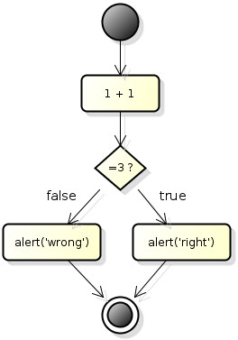

# Jack Ketch for JS Flows
A flow executor for javascript code.

**NOTE:** This document was created on February 9, 2015. Last update was on *February 10, 2015*.

## Goal
Get a JSON data structure representing something similar to an [Activity Diagram](http://en.wikipedia.org/wiki/Activity_diagram "Activity Diagram") and execute it!

Mainly get something like the diagram below:



and would be transformed into a JSON data structure similar to the one below:

```javascript
{
    "initial-node": { "id": "#1", "to-node": "#2" },
    "action-nodes": [
        { "id": "#2", "to-node": "#3", "action": "TestAction::sum" },
        { "id": "#4", "to-node": "#6", "action": "TestAction::displayRight" },
        { "id": "#5", "to-node": "#6", "action": "TestAction::displayWrong" }        
    ],
    "decision-nodes": [
        { 
            "id": "#3", 
            "to-nodes": [
                { 
                    "id": "#4", 
                    "context": {
                        "attribute": "result",
                        "value": "false"
                    }
                },
                { 
                    "id": "#5", 
                    "context": {
                        "attribute": "result",
                        "value": "true"
                    }
                }
            ]
        }
    ],
    "final-node": { "id": "#6" }
}
```

that would be executed calling the structure below:

```javascript
var TestAction = function() {
    this.sum = function(context) {
        context.result = 1 + 1;
    };
    
    this.sum = displayRight() {
        alert('Right');
    };

    this.sum = displayWrong() {
        alert('Wrong');
    };
}
```

This way the requirements provided by the stakeholder **can** be easily translated to an execution flow, easy to visualize, therefore easier to understand.

The developer role is to provide programming structures that can be bound to the flow and executed by an external engine.

## History
The previous goal may sound familiar to some, and sometimes you may call it [BPM](http://en.wikipedia.org/wiki/Business_process_management "Business process management"), but this project is not that ambitious.

#### 2012, what a year!
In 2012 I was lucky to participate in a project that involved a technology called [jBPM](http://www.jbpm.org/ "Java Business Process Management"). Quoting its official website: "The core of jBPM is a light-weight, extensible workflow engine written in pure Java that allows you to execute business processes". That was also the year I was on my second graduate course (lato sensu) and I was studying [Agile Modeling](http://www.agilemodeling.com/ ""), [Domain Driven Design](http://dddcommunity.org/ "DDD") and Model Transformations (using some theory from [MDA](http://www.omg.org/mda/ "Model Driven Architecture")) to bring more clarity to the existent *gap* between software engineering jargons and client's business language.

#### What was jBPM
In fact, the complete set of tools that is provided along jBPM allows much more. For example, it allowed the dev team to draw workflows using the IDE and reference java code within this diagrams, then the jBPM engine would be started and each part of the workflow would be executed. Summarizing, we bound classes and its methods to processes in the diagram, started a database transaction, put objects inside an in-memory context and the engine ran all the flow from the beginning to the end.

#### Too much sometimes is too much
The "problem" is that jBPM does much more, it works with an "on-the-fly" state persistence, using in-memory or filesystem databases with history logging for querying and monitoring and lots of integrations with other technologies. It was too much! And it was too heavy when all we wanted was a simple *flow executor*.

#### The rise and fall of my first OSS Project
That's when I had the idea to, based on our needs, implement a much simpler engine. In fact, an alfa, limited version (without asynchronous execution) was implemented but never went to production, mostly because I lost interest on it, but the difficulty to find a good UML tool that could export its diagram structure as files didn't burst my motivation either. The beta version used [ArgoUML](http://argouml.tigris.org/ "") for exporting Activity Diagrams to XMI, so basically, the link between visual diagrams and the executing engine was XML.

#### Lessons learned
One thing that was absolutely impressive was the capability of our stakeholder to discuss our solution just looking at the BPM diagram. Complex flows were simplified with colored shapes and our client was able to discuss about proposed solutions without having to dig down into complex lines of code that he wouldn't understand. Once I started to study javascript more deeply and its related technologies (NodeJS, promises, SPAs, ...), the asynchronous nature of the language seemed the perfect environment to try this project again (and to simplify a lot its dynamic, and sometimes, uncontrollable nature). So here I go!

#### Why "Jack Ketch"?
Well, I wanted something that meant "to execute", after all, this engine will be executing a flow. But "executor" or "runner" seemed too lame. So I remembered that an "executioner" executes people (of course, in another way) and then came the idea to call it [Jack Ketch](http://en.wikipedia.org/wiki/Jack_Ketch ""). Still lame? Well... Whatever man, maybe I'll change it in the future.

## The Flow
The main idea of this library is to:

1. Allow the execution of a workflow binding operations to its "executable" nodes;
2. Allow the flow to be controlled binding nodes results to different outcomes;
3. Allow to represent and execute synchronous and asynchronous processing.

For that I will use a limited set of UML's Activity Diagram elements, such as:

1. Initial Node

 

2. Action Node

 

3. Decision Node

 

4. Fork Node

 

5. Join Node

 
 
6. Control Flow

 

7. Final Node

 

I'm not going to explain any of these nodes in details, for that I would refer to [Visual Paradigm's Activity Diagram](http://www.visual-paradigm.com/VPGallery/diagrams/Activity.html "Activity Diagram Explanation") explanation.

**NOTE:** I did not included the **merge node** on purpose. In my opinion it will not be necessary in this initial versions.