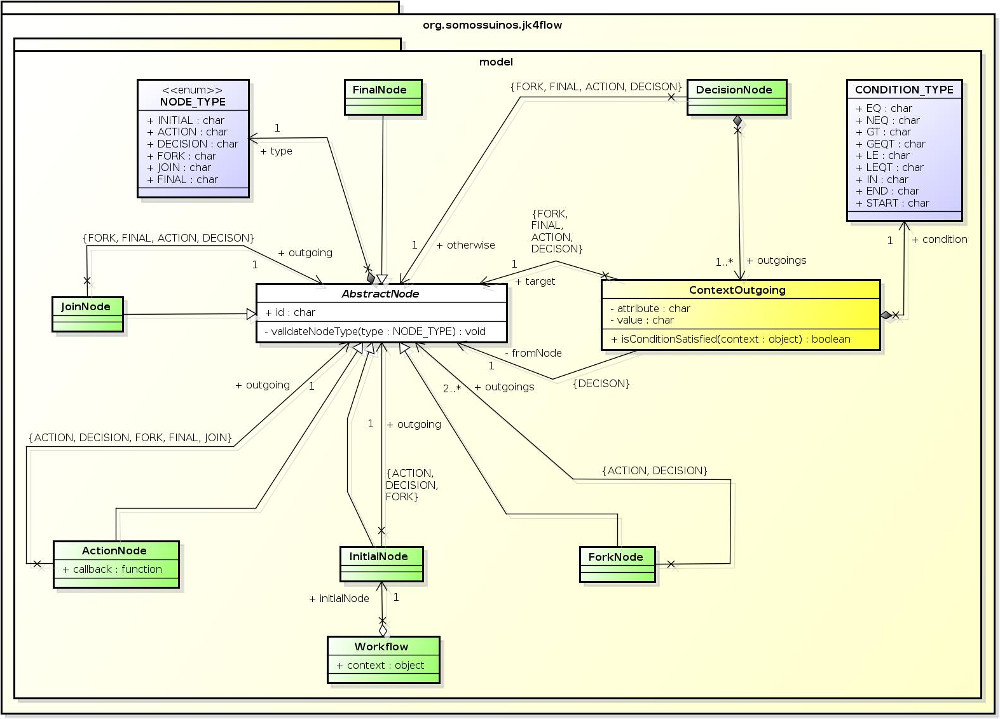

# **Jack Ketch for JS Flows**
A flow executor for javascript code. Hopefully it will work in both client and server side.

**NOTES:** 

1. At this moment, only the documentation can be validated. No code was developed (besides some tests to check the better structure to work with);
2. This document was created on **February 9, 2015**. Last update was on ***February 21, 2015***.

## [ Goal ]
To get a JSON data structure representing something similar to an [Activity Diagram](http://en.wikipedia.org/wiki/Activity_diagram "Activity Diagram") and **execute it**!

In other words, the main goal is to get something like the diagram below...


... And transform into a set of data structures similar to the ones below...


```
Note: since Javascript is not purely OO, this diagram does not strictly reflects the implementation
```
... That would be bound to some (object's) callbacks similar to the ones below...

```javascript
var SimpleDiagram = function() {
    this.sumOnePlusOne = function(context) {
        context.x = 1 + 1;
    };
    
    this.sumTwoPlusTwo = function(context) {
        context.y = 2 + 2;
    };
    
    this.sumXPlusY = function(context) {
        context.v = context.x + context.y;
    };

    this.showOk = function() {
        alert('Ok');
    };

    this.showNotOk = function() {
        alert('Not Ok');
    };
}
```
... And execute them.

This way the requirements provided by the stakeholder **can** be easily translated to an execution flow, easy to visualize, therefore easier to understand.

The developer role is to provide programming structures that can be bound to the flow and executed by an external engine.

## [ Special Notes ]
I intend to split this project in 4 (four) parts. So this one can focus on the execution engine.

The possibility to draw the diagram will be addressed in another project called **Jack Ketch for Draw** (or something similar), using [Raphaël - JavaScript Library](http://raphaeljs.com/ "Raphael"). I haven't decided yet what will be the JSON format the drawing structure will save the diagrams.

Another project ("**Jack Ketch for Transformation**"?) will provide some model transformation between drawing structures and the executable one. The main goal is to achieve a common model metadata that can be easily transformed from different sources. The current (possible) metadata structures are defined below (based on the previous diagram):

```javascript
var initialNodes = [ 
    { id: '#IN:0001' } 
];

var forkNodes = [ 
    { id: '#FN:0003' } 
];

var actionNodes = [ 
    { id: '#AN:0006', callback: 'SimpleDiagram::sumOnePlusOne' },
    { id: '#AN:0007', callback: 'SimpleDiagram::sumTwoPlusTwo' },
    { id: '#AN:0012', callback: 'SimpleDiagram::sumXPlusY' },
    { id: '#AN:0017', callback: 'SimpleDiagram::showOk' },
    { id: '#AN:0018', callback: 'SimpleDiagram::showNotOk' }
];

var joinNodes = [
    { id: '#JN:0010' } 
];

var decisionNodes = [
    { 
        id: '#DN:0014', 
        context: [ 
            { attribute: 'v', condition: '=', value: '6', controlFlows: '#CF:0015' }
        ],
        otherwise: { controlFlow: '#CF:0016' }
    } 
];

var finalNodes = [ 
    { id: '#FN:0021' } 
];

var controlFlows = [
    { id: '#CF:0002', from: '#IF:0001', to: '#FN:0003' },
    { id: '#CF:0004', from: '#FN:0003', to: '#AN:0006' },
    { id: '#CF:0005', from: '#FN:0003', to: '#AN:0007' },
    { id: '#CF:0008', from: '#AN:0006', to: '#JN:0010' },
    { id: '#CF:0009', from: '#AN:0007', to: '#JN:0010' },
    { id: '#CF:0011', from: '#JN:0010', to: '#AN:0012' },
    { id: '#CF:0013', from: '#AN:0012', to: '#DN:0014' },
    { id: '#CF:0015', from: '#DN:0014', to: '#AN:0017' },
    { id: '#CF:0016', from: '#DN:0014', to: '#AN:0018' },
    { id: '#CF:0019', from: '#AN:0017', to: '#FN:0021' },
    { id: '#CF:0020', from: '#AN:0018', to: '#FN:0021' }
];
```

The last project is an HTML 5 application (probably called **Jack Ketch App**) that will allow plotting the diagram and setting each nodes attributes (something similar to an IDE). It should also be able to save the diagram in some text format (JSON?) to be transformed in an executable workflow.

## [ History ]
The previous goal may sound familiar to some, and sometimes you may call it [BPM](http://en.wikipedia.org/wiki/Business_process_management "Business process management"), but this project is not that ambitious.

#### 2012, what a year!
In 2012 I was lucky to participate in a project that involved a technology called [jBPM](http://www.jbpm.org/ "Java Business Process Management"). Quoting its official website: "The core of jBPM is a light-weight, extensible workflow engine written in pure Java that allows you to execute business processes". That was also the year I was on my second graduate course (lato sensu) and I was studying [Agile Modeling](http://www.agilemodeling.com/ ""), [Domain Driven Design](http://dddcommunity.org/ "DDD") and Model Transformations (using some theory from [MDA](http://www.omg.org/mda/ "Model Driven Architecture")) to bring more clarity to the existent *gap* between software engineering jargons and client's business language.

#### What was jBPM
In fact, the complete set of tools that is provided along jBPM allows much more. For example, it allowed the dev team to draw workflows using the IDE and reference java code within this diagrams, then the jBPM engine would be started and each part of the workflow would be executed. Summarizing, we bound classes and its methods to processes in the diagram, started a database transaction, put objects inside an in-memory context and the engine ran all the flow from the beginning to the end.

#### Too much sometimes is too much
The "problem" is that jBPM does much more, it works with an "on-the-fly" state persistence, using in-memory or file system databases with history logging for querying and monitoring and lots of integrations with other technologies. It was too much! And even being faster than we expected, sometimes was too "heavy" when all we wanted was a simple *flow executor* (specially when some flows should execute within miliseconds).

#### The rise and fall of my first OSS Project
That's when I had the idea to implement a much simpler engine without all the overhead jBPM offered. In fact, an alfa, limited version (without asynchronous execution) was implemented but never went to production, mostly because I lost interest on it, but the difficulty to find a good UML tool that could export its diagram structure as files didn't burst my motivation either. The alfa version used [ArgoUML](http://argouml.tigris.org/ "") for exporting Activity Diagrams to XMI so, basically, the link between visual diagrams and the executing engine was XML.

#### Lessons learned
One thing that impressed me in the project using jBPM was the capability of our stakeholder to discuss our solution just looking at the flow diagram. Complex flows were simplified with colored shapes and our client was able to discuss about proposed solutions without having to dig down into complex lines of code that he wouldn't understand. Once I started to study javascript more deeply and its related technologies (NodeJS, promises, SPAs, ...), the asynchronous nature of the language seemed the perfect environment to try this project again (and to simplify a lot javascript's dynamic, and sometimes, *uncontrollable* nature). So here I go!

#### Why "Jack Ketch"?
Well, I wanted something that meant "to execute", after all, this engine will be executing a flow. But "executor" or "runner" seemed too lame. So I remembered that an "executioner" executes people (of course, in a different way) and then came the idea to call it [Jack Ketch](http://en.wikipedia.org/wiki/Jack_Ketch ""). Still lame? Well... Whatever, maybe I'll change it in the future.

## [ The Flow Structure ]
The main idea of this library is to:

1. Allow the execution of a workflow binding operations to its "executable" nodes;
2. Allow the flow to be controlled binding nodes results to different outcomes;
3. Allow to represent and execute synchronous and asynchronous processing.

For that I will use a limited set of UML's Activity Diagram elements, such as:

#### 1. Initial Node


 
It is only a kickstart point to let the engine know where to begin processing.

**Basic Rules:**
+ No flow coming into;
+ Only one flow going out;
+ Its outgoing flow must target an Action Node, a Decision Node or a Fork Node.

#### 2. Action Node

 

Where the magic happens! Each action node corresponds to a programming unit responsible for some real processing of the workflow. It is done by associating one callback (function/method) to it. Any callback will always receive one *flow context* object as first argument, this object wraps all data that mst be passed by through the flow execution. If the action node needs to pass along some information, just put it into the flow context object, no need to return anything.

**Basic Rules:**
+ Many as possible flows coming into;
+ Only one flow going out;
+ Its outgoing flow may target another Action Node, a Final Node, a Decision Node, a Fork Node and even a Join Node, but only if it is part of an asynchronous flow started by a previous Fork Node.

#### 3. Decision Node

 

Will take the decision of which will be the next step of the workflow. It will check a previously set attribute value from the *flow context* object that is passed along through the entire flow. According to the attribute value it will redirect the flow to one of its outgoing control flows.

**Basic Rules:**
+ Many as possible flows coming into;
+ Two or more flows going out. Actually, there must be at least one flow to match to the context attribute and one flow otherwise. There must always be an outgoing *otherwise* flow;
+ Its outgoing flow may target an Action Node, a Final Node, another Decision Node or a Fork Node. To prevent unexpected behaviors I discourage targeting a join node.

#### 4. Fork Node

 

Starts an asynchronous process.

All flows going out a Fork Node will be treated asynchronously until they find a Join Node, where processing becomes synchronous again.

Be aware that starting many asynchronous flows may be hard to manage, it also may happen if an asynchronous flow drives back to some node in the flow that was previously synchronous. Pay attention when diagramming complex workflows.

**Basic Rules:**
+ Many as possible flows coming into;
+ Two or more flows going out.
+ Its outgoing flows may target an Action Node or a Decision Node. Do not terminate an asynchronous process without joining it again, please.

#### 5. Join Node

 

Responsible for gathering all asynchronous processes started by a Fork Node.
 
**Basic Rules:**
+ Many as possible flows coming into;
+ Only one flow going out;
+ Its outgoing flow may target an Action Node, Decision Node, a Final Node or another Fork Node. Think about it! I could only start a set of asynchronous processes to speed up data gathering. After having all data needed, start another to speed up its use.

#### 6. Final Node

 
 
Establishes the end of the flow.

At first I thought this node wasn't really necessary, for example, if I just reach a last Action Node (without outgoing control flow) the flow should be terminated too. But the Final Node, besides establishing a formal end to our workflow, should allow the return of the context flow object to the programming structure that started it. So I decided to make it mandatory, and to simplify (my life, of course) I also insist that it shall be unique (*there can be only one!*).

**Basic Rules:**
+ Many as possible flows coming into;
+ No flow going out.

#### 7. Control Flow

 
 
Links two (and only two) nodes together. Indicates from where to where the flow goes and it is not allowed to link a node to itself (cyclic dependency).

**Basic Rules:**
+ Link one node to another;
+ The start node cannot be the same as the end node.

#### NOTES

I'm not going to explain any of these elements in details, for that I would refer to [Visual Paradigm's Activity Diagram](http://www.visual-paradigm.com/VPGallery/diagrams/Activity.html "Activity Diagram Explanation") explanation.

I did not included the **merge node** on purpose. In my opinion it will not be necessary in this initial versions. As for all the other elements existing in UML 2.0 Activity Diagram, once again: "too much sometimes is too much".

## [ The Flow Context Object ]
The *flow context* object is just a regular Javascript object that will be passed on to each node in the diagram so each part of the flow can make use of previous processed information.

One good use for this context object is, for instance, start a transaction before starting the flow, put the transaction object inside the context object and then start the flow execution passing the context object to it. Once the flow is finished, commit the transaction (or roll it back).

## [ Modules ]

### JSON Flow Parser & Transformer
```
NOTE: The set of arrays that were explained before is going to be part of another project. The reason is that the previous data structures were out of this project's scope as explained in the "Special Notes" topic at the beginning of this document.
```

## [ Workflow Engine ]
The main goal of the engine is very simple:

+ Executes the connected object instances by "traveling" through each dependency tree;
+ The *flow context* object "travels along", node by node;
+ Action Nodes must execute related callbacks;
+ Decision Nodes must check for context attributes to drive the flow;
+ Fork Nodes must start a set of promises to be called asynchronously;
+ Join Nodes must gather all this asynchronous promises.s

In the next days (weeks?) I'll update this document with proposed implementation of the workflow engine.

# **Thanks to...**
... The development team and supporters of the applications below, without them I could not even start this project at such low cost (I'm $upporting some of them, just to let you know):
+ Astah Community - [http://astah.net/editions/community](http://astah.net/editions/community "http://astah.net/editions/community")
+ Gimp - [http://www.gimp.org/](http://www.gimp.org/ "http://www.gimp.org/")
+ Git - [http://git-scm.com/](http://git-scm.com/ "http://git-scm.com/")
+ GitHub - [https://github.com/](https://github.com/ "https://github.com/")
+ Node.js - [http://nodejs.org/](http://nodejs.org/ "http://nodejs.org/")
+ MdCharm - [http://www.mdcharm.com/](http://www.mdcharm.com/ "http://www.mdcharm.com/")
+ Ubuntu Desktop - [http://www.ubuntu.com/desktop](http://www.ubuntu.com/desktop "http://www.ubuntu.com/desktop")
+ Google Chrome - [http://www.google.com/chrome/](http://www.google.com/chrome/ "http://www.google.com/chrome/")
+ Mozilla Firefox - [https://www.mozilla.org/en-US/firefox/new/](https://www.mozilla.org/en-US/firefox/new/ "https://www.mozilla.org/en-US/firefox/new/")
+ All the guys that create Javascript libraries that are commonly (or not that commonly) used!

I could thank to [WebStorm](https://www.jetbrains.com/webstorm/ "WebStorm") team and all the guys in JetBrains, but since I'm paying for their software, I won't.

# **License**
```
The MIT License (MIT)

Copyright (c) 2015 Alejo Ceballos

Permission is hereby granted, free of charge, to any person obtaining a copy
of this software and associated documentation files (the "Software"), to deal
in the Software without restriction, including without limitation the rights
to use, copy, modify, merge, publish, distribute, sublicense, and/or sell
copies of the Software, and to permit persons to whom the Software is
furnished to do so, subject to the following conditions:

The above copyright notice and this permission notice shall be included in all
copies or substantial portions of the Software.

THE SOFTWARE IS PROVIDED "AS IS", WITHOUT WARRANTY OF ANY KIND, EXPRESS OR
IMPLIED, INCLUDING BUT NOT LIMITED TO THE WARRANTIES OF MERCHANTABILITY,
FITNESS FOR A PARTICULAR PURPOSE AND NONINFRINGEMENT. IN NO EVENT SHALL THE
AUTHORS OR COPYRIGHT HOLDERS BE LIABLE FOR ANY CLAIM, DAMAGES OR OTHER
LIABILITY, WHETHER IN AN ACTION OF CONTRACT, TORT OR OTHERWISE, ARISING FROM,
OUT OF OR IN CONNECTION WITH THE SOFTWARE OR THE USE OR OTHER DEALINGS IN THE
SOFTWARE.
```