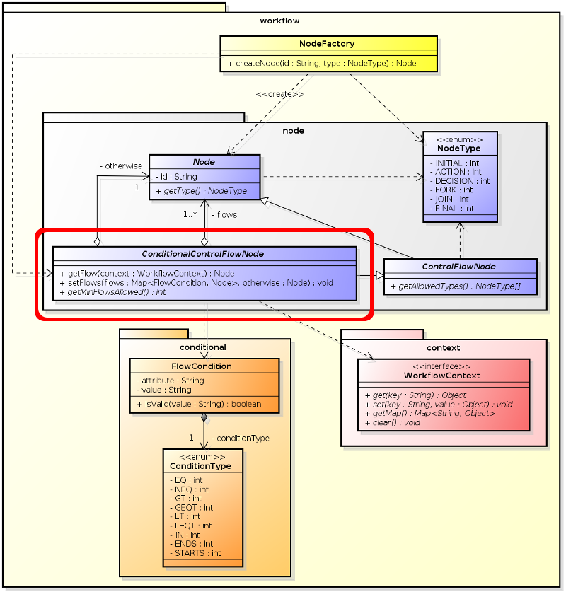
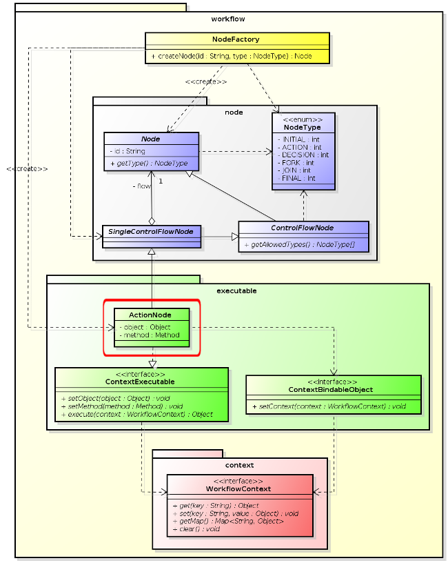

# **Jack Ketch for Java**

The flow executor for Java projects.

**NOTE:** 
+ This document was created on **April 26, 2015**. Last update was on ***May 27 2015***.

## [ Goal ]

Make [jk4flow](https://github.com/alejoceballos/jack-ketch-4-flow "Jack Ketch 4 Flow") project in Java a **reality**!

# Subprojects

**Jack Ketch for Java** project can be separated in other 3 (three) projects (at least, until now):

1. **Workflow:** Responsible for all workflow domain model;
2. **Engine:** Responsible for executing the workflow model;
3. **Transformer:** Responsible for transforming a JSON file into a "living" workflow instance;

## **Workflow** Project (jk4j-workflow)

Responsible for all workflow domain model.

In this project you may find all classes responsible for representing an Activity Model Diagram. Since we declare pure OO classes in Java, all entities such as Actions, Decisions, Forks and so on are concrete implementations of node's abstractions.

All descriptions for workflow's node rules are described in [Jack Ketch for Flow main page](../README.md "Jack Ketch for Flow main page").

### 1. Initial Node & Join Node

All Initial and Join nodes are direct implementations of **SingleControlFlowNode** with its respective **NodeType**. 

**SingleControlFlowNode** is the main abstraction for nodes that forwards to only one outgoing node.

**NOTE:** *Even though Action Node is also a SingleControlFlowNode, its complexity forces its own description (see description in the fifth topic).*

The only way to get instances of these nodes is making use of **NodeFactory**.


**Usage**
```java

    Node iNode = NodeFactory.createNode('#ID', NodeType.INITIAL);
    ((SingleControlFlowNode) iNode).setFlow( /* <another-node> */ );    
    
```
and
```java

    Node jNode = NodeFactory.createNode("#ID", NodeType.JOIN);
    ((SingleControlFlowNode) jNode).setFlow( /* <another-node> */ );
    
```

### 2. Decision Node

TBD



### 3. Fork Node

TBD

### 4. Final Node

TBD

### 5. Action Node

Action node is the only concrete class representing a node object due to its importance in the whole flow process. It extends from **SingleControlFlowNode** since it has only one outgoing flow, but also implements **ContextExecutable**, which allows to call the object that performs the action.

The bindable object, by-the-way, can implement **ContextBindableObject**, if so, the action will be able to pass a **WorkflowContext** to be handle by its.

To get instances of these nodes you can use **NodeFactory** or create directly using **new** keyword. I strongly recommend the first approach.



**Usage**
```java

    Node aNode = NodeFactory.createNode('#ID', NodeType.ACTION);
    ((SingleControlFlowNode) aNode).setFlow( /* <another-node> */ );
    ((ContextExecutable) aNode).setObject( /* <some object> */ );
    ((ContextExecutable) aNode).setMethod( /* <some-method-using-reflection> */ );

```

## **Engine** Project (jk4j-engine)

Responsible for executing the workflow model.

TBD

### 1. Handling **ContextExecutable** objects

TBD

### 2. Handling **SingleControlFlowNode** objects

TBD

### 3. Handling **ConditionalControlFlowNode** objects

TBD

### 4. Handling **MultipleControlFlowNode** objects

TBD

## **Transformer** Project (jk4j-transformer)

Responsible for reading a JSON activity diagram and creating an workflow instance.

**NOTE:** *It is this project intention to implement XML translators since most of third-party visual modelers save their diagrams in XMI format.*

# By the way...
If you find any broken link, English mistakes (there must be tons) or any type of fix you think its worth of noticing... Please, **contact me**! My contact info can be found in my **GitHub** profile. Thanks!

[ [https://github.com/alejoceballos](https://github.com/alejoceballos "https://github.com/alejoceballos") ]

# **License**
```
The MIT License (MIT)

Copyright (c) 2015 Alejo Ceballos

Permission is hereby granted, free of charge, to any person obtaining a copy
of this software and associated documentation files (the "Software"), to deal
in the Software without restriction, including without limitation the rights
to use, copy, modify, merge, publish, distribute, sublicense, and/or sell
copies of the Software, and to permit persons to whom the Software is
furnished to do so, subject to the following conditions:

The above copyright notice and this permission notice shall be included in all
copies or substantial portions of the Software.

THE SOFTWARE IS PROVIDED "AS IS", WITHOUT WARRANTY OF ANY KIND, EXPRESS OR
IMPLIED, INCLUDING BUT NOT LIMITED TO THE WARRANTIES OF MERCHANTABILITY,
FITNESS FOR A PARTICULAR PURPOSE AND NONINFRINGEMENT. IN NO EVENT SHALL THE
AUTHORS OR COPYRIGHT HOLDERS BE LIABLE FOR ANY CLAIM, DAMAGES OR OTHER
LIABILITY, WHETHER IN AN ACTION OF CONTRACT, TORT OR OTHERWISE, ARISING FROM,
OUT OF OR IN CONNECTION WITH THE SOFTWARE OR THE USE OR OTHER DEALINGS IN THE
SOFTWARE.
```
