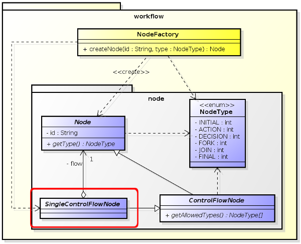

# **Jack Ketch for Java**

The flow executor for Java projects.

**NOTE:** 
+ This document was created on **April 26, 2015**. Last update was on ***May 26, 2015***.

## [ Goal ]

Make [jk4flow](https://github.com/alejoceballos/jack-ketch-4-flow "Jack Ketch 4 Flow") project in Java a **reality**!

# Subprojects

**Jack Ketch for Java** project can be separated in other 3 (three) projects (at least, until now):

1. **Workflow:** Responsible for all workflow domain model;
2. **Engine:** Responsible for executing the workflow model;
3. **Transformation:** Responsible for transforming a JSON file into a "living" workflow instance;

## **Workflow** Project (jk4j-workflow)

Responsible for all workflow domain model.

In this project you may find all classes responsible for representing an Activity Model Diagram. Since we declare pure OO classes in Java, all entities such as Actions, Decisions, Forks and so on are concrete implementations of node's abstractions.

All descriptions for workflow's node rules are described in [Jack Ketch for Flow main page](../README.md "Jack Ketch for Flow main page").

### 1. Initial Node & Join Node

All Initial and Join nodes are direct implementations of **SingleControlFlowNode** with its respective **NodeType**. 

**SingleControlFlowNode** is the main abstraction for nodes that forwards to only one outgoing node.

The only way to get instances of these nodes is making use of **NodeFactory**.



**Usage**
```java

    Node iNode = NodeFactory.createNode('#ID', NodeType.INITIAL);
    ((SingleControlFlowNode) iNode).setFlow( /* <another-node> */ );    
    
```
and
```java

    Node jNode = NodeFactory.createNode("#ID", NodeType.JOIN);
    ((SingleControlFlowNode) jNode).setFlow( /* <another-node> */ );
    
```

### 2. Action Node

TBD

### 3. Decision Node

TBD

### 4. Fork Node

TBD

### 5. Final Node

TBD

## **Engine** Project (jk4j-engine)

Responsible for executing the workflow model.

TBD

### 1. Handling **ContextExecutable** objects

TBD

### 2. Handling **SingleControlFlowNode** objects

TBD

### 3. Handling **ConditionalControlFlowNode** objects

TBD

### 4. Handling **MultipleControlFlowNode** objects

TBD

## **Transformer** Project (jk4j-transformer)

Responsible for reading a JSON activity diagram and creating an workflow instance.

**NOTE:** *It is this project intention to implement XML translators since most of third-party visual modelers save their diagrams in XMI format.*